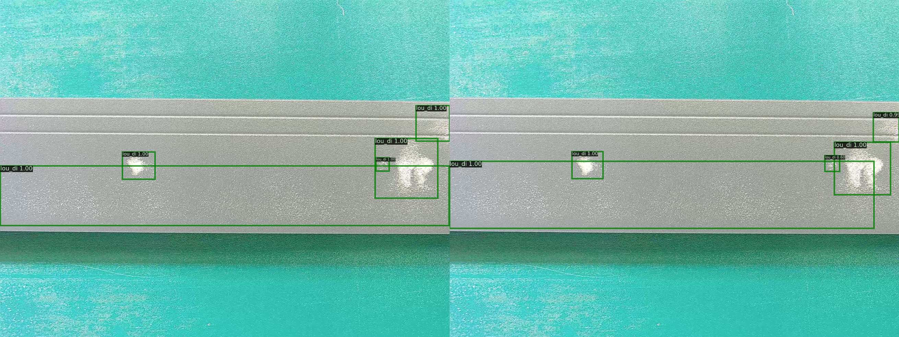
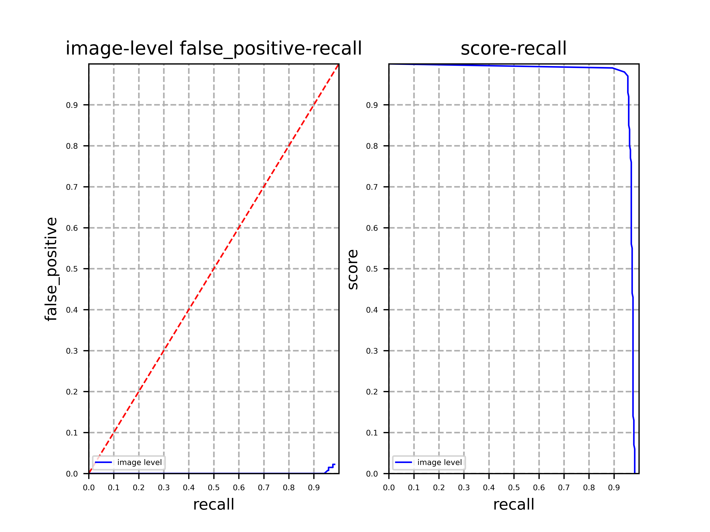
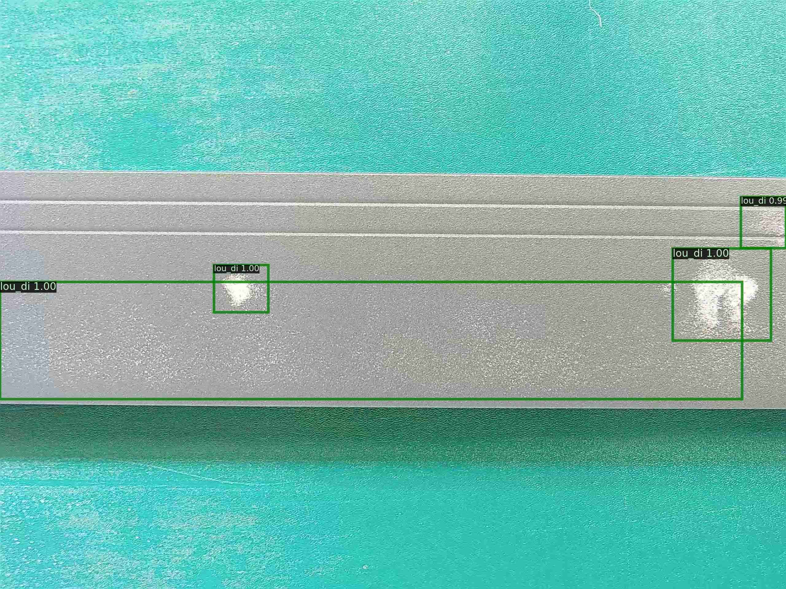

# GPU端最终解决方案

本案例面向GPU端的最终方案是选择二阶段检测模型FasterRCNN，其骨干网络选择加入了可变形卷积（DCN）的ResNet50_vd，训练时使用SSLD蒸馏方案训练得到的ResNet50_vd预训练模型，FPN部分的通道数量设置为64，训练阶段数据增强策略采用RandomHorizontalFlip、RandomDistort、RandomCrop，并加入背景图片，测试阶段的RPN部分做非极大值抑制计算的候选框数量由原本的6000减少至500、做完非极大值抑制后保留的候选框数量由原本的1000减少至300。

在Tesla P40的Linux系统下，对于输入大小是800 x 1333的模型，图像预处理时长为30ms/image，模型的推理时间为46.08ms/image，包括输入数据拷贝至GPU的时间、计算时间、数据拷贝至CPU的时间。

| 模型 | VOC mAP (%) | 推理时间 (ms/image)
| -- | -- | -- |
| FasterRCNN-ResNet50_vd_ssld | 81.05 | 48.62 |
| + dcn | 88.09 | 66.51 |
| + RandomHorizontalFlip/RandomDistort/RandomCrop | 90.23| 66.51 |
| + background images | 88.87 | 66.51 |
| + fpn channel=64 | 87.79 | 48.65 |
| + test proposal=pre/post topk 500/300 | 87.72 | 46.08 |

## 前置依赖

* Paddle paddle >= 1.8.0
* Python >= 3.5
* PaddleX >= 1.3.0

## 模型训练

### (1) 下载PaddleX源码

```
git clone https://github.com/PaddlePaddle/PaddleX

cd PaddleX/examples/industrial_quality_inspection
```

### (2) 下载数据集

因数据集较大，可运行以下代码提前将数据集下载并解压。训练代码中也会自动下载数据集，所以这一步不是必须的。

```
wget https://bj.bcebos.com/paddlex/examples/industrial_quality_inspection/datasets/aluminum_inspection.tar.gz
tar xvf aluminum_inspection.tar.gz
```
### (3) 下载预先训练好的模型

如果不想再次训练模型，可以直接下载已经训练好的模型完成后面的模型测试和部署推理：

```
wget https://bj.bcebos.com/paddlex/examples/industrial_quality_inspection/models/faster_rcnn_r50_vd_dcn.tar.gz
tar xvf faster_rcnn_r50_vd_dcn.tar.gz
```
### (4) 训练

运行以下代码进行模型训练，代码会自动下载数据集，如若事先下载了数据集，需将下载和解压铝材缺陷检测数据集的相关行注释掉。代码中默认使用0,1,2,3,4号GPU训练，可根据实际情况设置卡号并调整`batch_size`和`learning_rate`。

```
python train_rcnn.py
```

### (5) 分析预测错误的原因

在模型迭代过程中，运行以下代码可完成模型效果的分析并生成分析结果图表：

```
python error_analysis.py
```

可参考[性能优化部分的模型效果分析](./accuracy_improvement.md#2-%E6%A8%A1%E5%9E%8B%E6%95%88%E6%9E%9C%E5%88%86%E6%9E%90)来理解当前模型预测错误的原因。

运行以下代码，生成可视化真值和预测结果的对比图以进一步理解模型效果，代码中的置信度阈值可根据实际情况进行调整。

```
python compare.py
```



左边是可视化真值，右边是可视化预测结果。

### (6) 统计图片级召回率和误检率

模型迭代完成后，计算不同置信度阈值下[图片级召回率](./accuracy_improvement.md#6-%E8%83%8C%E6%99%AF%E5%9B%BE%E7%89%87%E5%8A%A0%E5%85%A5)和[图片级误检率](./accuracy_improvement.md#6-%E8%83%8C%E6%99%AF%E5%9B%BE%E7%89%87%E5%8A%A0%E5%85%A5)，找到符合要求的召回率和误检率，对应的置信度阈值用于后续模型预测阶段。

```
python cal_tp_fp.py
```

执行后会生成图表`image-level_tp_fp.png`和文件`tp_fp_list.txt`，示意如下：

| 图表`image-level_tp_fp.png` | 文件`tp_fp_list.txt` |
| -- | -- |
|  | [tp_fp_list.txt](tp_fp_list.md) |

图表`image-level_tp_fp.png`中左边子图，横坐标表示不同置信度阈值下计算得到的图片级召回率，纵坐标表示各图片级召回率对应的图片级误检率。右边子图横坐标表示图片级召回率，纵坐标表示各图片级召回率对应的置信度阈值。从图表中可较为直观地看出当前模型的图片级召回率和误检率的量级，从文件`tp_fp_list.txt`可以查到具体数值，例如在图片级召回率/图片级误检率为[0.9589，0.0074]这一组符合要求，就将对应的置信度阈值0.90选取为后续预测推理的阈值。

### (7) 模型测试

测试集因没有标注文件，这里单独下载测试集图片:

```
wget https://bj.bcebos.com/paddlex/examples/industrial_quality_inspection/datasets/aluminum_inspection_test.tar.gz
tar xvf aluminum_inspection_test.tar.gz
```

加载训练好的模型，使用(5)选取的置信度阈值0.90对验证集图片或者测试集图片进行预测:

```
python predict.py
```
可视化预测结果示例如下：



## 推理部署

本案例采用C++部署方式将模型部署在Tesla P40的Linux系统下，具体的C++部署流程请参考文档[PaddleX模型多端安全部署/C++部署](https://paddlex.readthedocs.io/zh_CN/develop/deploy/server/cpp/index.html)。

对于输入大小是800 x 1333的模型，图像预处理时长为30ms/image。值得一提的是预处理中的Normalize操作比较耗时，因此在设置预处理操作时，可以先进行Resize操作再做Normalize。模型的推理时间为46.08ms/image，包括输入数据拷贝至GPU的时间、计算时间、数据拷贝至CPU的时间。
