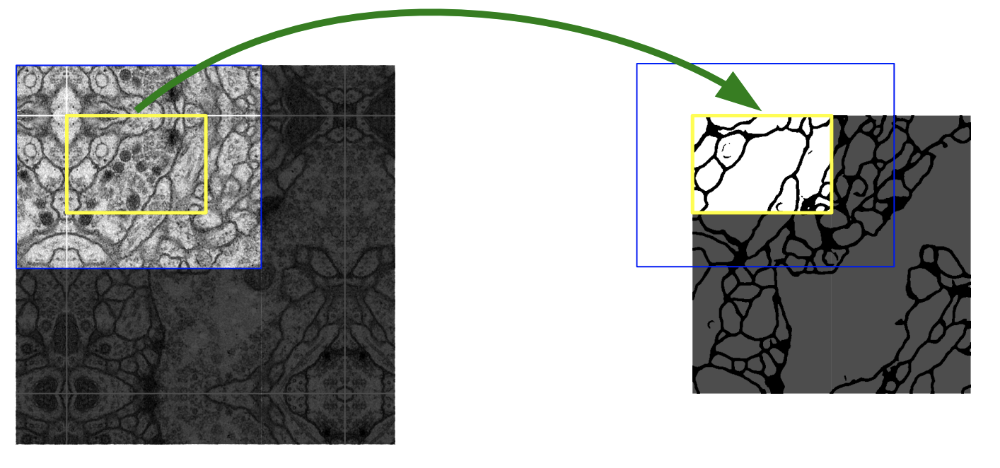
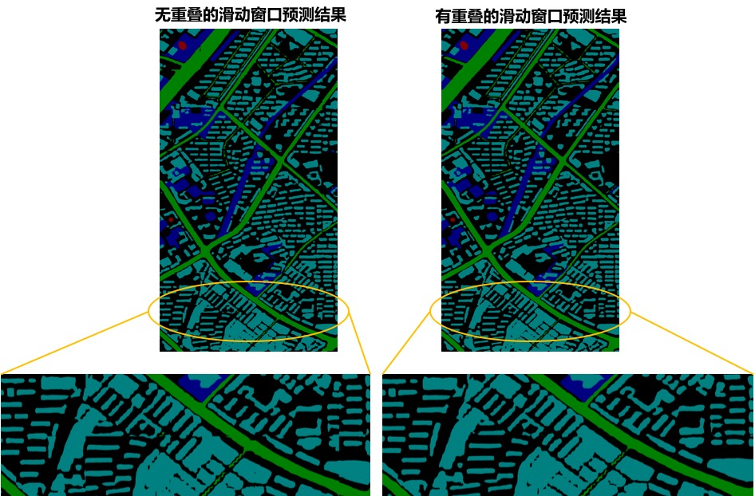

# RGB遥感影像分割

本案例基于PaddleX实现遥感影像分割，提供滑动窗口预测方式，以避免在直接对大尺寸图片进行预测时显存不足的发生。此外，滑动窗口之间的重叠程度可配置，以此消除最终预测结果中各窗口拼接处的裂痕感。

## 目录
* [数据准备](#1)
* [模型训练](#2)
* [模型预测](#3)
* [模型评估](#4)

#### 前置依赖

* Paddle paddle >= 1.8.4
* Python >= 3.5
* PaddleX >= 1.1.4

安装的相关问题参考[PaddleX安装](../install.md)

下载PaddleX源码:

```
git clone https://github.com/PaddlePaddle/PaddleX
```

该案例所有脚本均位于`PaddleX/examples/remote_sensing/`，进入该目录：

```
cd PaddleX/examples/remote_sensing/
```

## <h2 id="1">数据准备</h2>

本案例使用2015 CCF大数据比赛提供的高清遥感影像，包含5张带标注的RGB图像，图像尺寸最大有7969 × 7939、最小有4011 × 2470。该数据集共标注了5类物体，分别是背景（标记为0）、植被（标记为1）、建筑（标记为2）、水体（标记为3）、道路 （标记为4）。

本案例将前4张图片划分入训练集，第5张图片作为验证集。为增加训练时的批量大小，以滑动窗口为(1024，1024)、步长为(512, 512)对前4张图片进行切分，加上原本的4张大尺寸图片，训练集一共有688张图片。在训练过程中直接对大图片进行验证会导致显存不足，为避免此类问题的出现，针对验证集以滑动窗口为(769, 769)、步长为(769，769)对第5张图片进行切分，得到40张子图片。

运行以下脚本，下载原始数据集，并完成数据集的切分：

```
python prepare_data.py
```

## <h2 id="2">模型训练</h2>

分割模型选择Backbone为MobileNetv3_large_ssld的Deeplabv3模型，该模型兼备高性能高精度的优点。运行以下脚本，进行模型训练：
```
python train.py
```

也可以跳过模型训练步骤，直接下载预训练模型进行后续的模型预测和评估：
```
wget https://bj.bcebos.com/paddlex/examples/remote_sensing/models/ccf_remote_model.tar.gz
tar -xvf ccf_remote_model.tar.gz
```

## <h2 id="3">模型预测</h2>

直接对大尺寸图片进行预测会导致显存不足，为避免此类问题的出现，本案例提供了滑动窗口预测接口，支持有重叠和无重叠两种方式。

* 无重叠的滑动窗口预测

在输入图片上以固定大小的窗口滑动，分别对每个窗口下的图像进行预测，最后将各窗口的预测结果拼接成输入图片的预测结果。由于每个窗口边缘部分的预测效果会比中间部分的差，因此每个窗口拼接处可能会有明显的裂痕感。

该预测方式的API接口详见[overlap_tile_predict](https://paddlex.readthedocs.io/zh_CN/develop/apis/models/semantic_segmentation.html#overlap-tile-predict)，**使用时需要把参数`pad_size`设置为`[0, 0]`**。

* 有重叠的滑动窗口预测

在Unet论文中，作者提出一种有重叠的滑动窗口预测策略（Overlap-tile strategy）来消除拼接处的裂痕感。对各滑动窗口预测时，会向四周扩展一定的面积，对扩展后的窗口进行预测，例如下图中的蓝色部分区域，到拼接时只取各窗口中间部分的预测结果，例如下图中的黄色部分区域。位于输入图像边缘处的窗口，其扩展面积下的像素则通过将边缘部分像素镜像填补得到。

该预测方式的API接口说明详见[overlap_tile_predict](https://paddlex.readthedocs.io/zh_CN/develop/apis/models/semantic_segmentation.html#overlap-tile-predict)。



相比无重叠的滑动窗口预测，有重叠的滑动窗口预测策略将本案例的模型精度miou从80.58%提升至81.52%，并且将预测可视化结果中裂痕感显著消除，可见下图中两种预测方式的效果对比。



运行以下脚本使用有重叠的滑动窗口进行预测：
```
python predict.py
```

## <h2 id="4">模型评估</h2>

在训练过程中，每隔10个迭代轮数会评估一次模型在验证集的精度。由于已事先将原始大尺寸图片切分成小块，此时相当于使用无重叠的滑动窗口预测方式，最优模型精度miou为80.58%。运行以下脚本，将采用有重叠的滑动窗口预测方式，重新评估原始大尺寸图片的模型精度，此时miou为81.52%。
```
python eval.py
```
